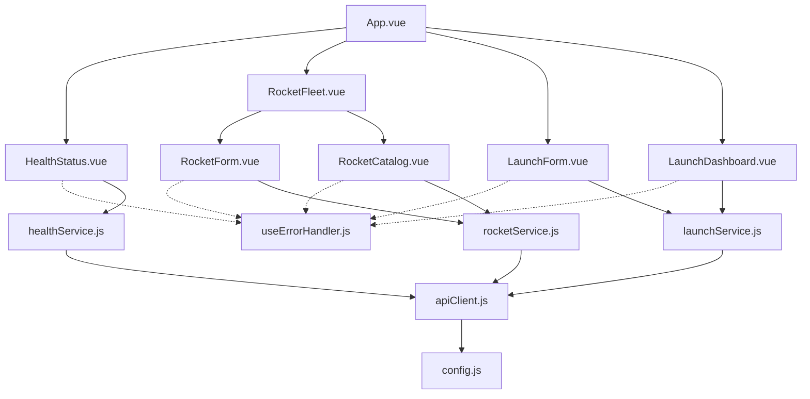

# Requirements

### Overview & Goals
The goal is to address the technical debt and architectural defects identified in the frontend quality report (`front.quality.report.md`). This includes improving component modularity, centralizing API logic, standardizing error handling, and enhancing code readability.

### Scope
- **In Scope**:
    - Refactoring of all Vue components in `front/src/components/`.
    - Refactoring of all API services in `front/src/services/`.
    - Introduction of shared utilities (apiClient) and composables (useErrorHandler).
- **Out of Scope**:
    - Backend modifications.
    - New feature development.

### Functional Requirements
- **Consistency**: All API calls must follow the same pattern and use a centralized configuration.
- **Modularity**: Large components with mixed responsibilities must be split.
- **Readability**: Code must use descriptive naming and avoid common abbreviations in error handling.
- **Maintainability**: Redundant logic (like initial state and error reporting) must be centralized.

# Technical Design

### Current Implementation
- API URLs are hardcoded in services.
- Error handling is inconsistent (some services throw, others catch; components repeat error state and notification logic).
- `RocketFleet.vue` is a "fat" component managing both form and list.
- Template logic in `LaunchDashboard.vue` is complex and hard to read.

### Key Decisions
1. **Centralized API Client (apiClient.js)**: Use a shared wrapper for `fetch` to ensure consistent handling of response status and errors.
2. **Error Handler Composable (useErrorHandler.js)**: Use Vue's Composition API to share the logic for managing component error states and showing notifications.
3. **Component Splitting**: Follow the "Single Responsibility Principle" by separating the Rocket form from the catalog.
4. **Computed Actions**: Move status transition logic from the template to computed properties in `LaunchDashboard.vue` to improve template clarity.

### Proposed Changes

#### Infrastructure & Services
- **`front/src/config.js`**: Centralized configuration.
- **`front/src/services/apiClient.js`**: Core fetch logic.
- **`front/src/services/*.js`**: Refactored to use the client and better naming.

#### Shared Logic
- **`front/src/composables/useErrorHandler.js`**: Centralized UI error management.

#### Component Refactoring
- **`front/src/components/RocketForm.vue`**: New component for rocket registration.
- **`front/src/components/RocketCatalog.vue`**: New component for rocket listing.
- **`front/src/components/LaunchDashboard.vue`**: Extracting complex `v-if` logic to script.

### Architecture Diagram

# Implementation Plan

# report - front-quality - front

## Specification
Implementation plan to address the defects identified in the frontend quality report, focusing on structural complexity, naming consistency, and redundancy.

**Context**: [front.quality.report.md](../reports/front.quality.report.md)

## Implementation Steps

### Step 1: Centralize API Infrastructure
Standardize how the application communicates with the backend.
- Paths:
    - `front/src/config.js`
    - `front/src/services/apiClient.js`
    - `front/src/services/healthService.js`
    - `front/src/services/launchService.js`
    - `front/src/services/rocketService.js`
- [ ] Create `config.js` with `API_BASE_URL`.
- [ ] Implement `apiClient.js` with consistent error handling and base URL prepending.
- [ ] Refactor all API services to use the new client and descriptive variable names.

### Step 2: Implement Shared UI Logic
Eliminate redundant code in components.
- Paths:
    - `front/src/composables/useErrorHandler.js`
    - `front/src/components/RocketFleet.vue`
    - `front/src/components/LaunchForm.vue`
- [ ] Create `useErrorHandler` composable to manage `error` state and `notify()` calls.
- [ ] Extract initial form states to constants (`INITIAL_ROCKET_FORM`, `INITIAL_LAUNCH_FORM`).

### Step 3: Refactor RocketFleet Component
Improve structural modularity by splitting responsibilities.
- Paths:
    - `front/src/components/RocketForm.vue`
    - `front/src/components/RocketCatalog.vue`
    - `front/src/components/RocketFleet.vue`
- [ ] Extract the form part to `RocketForm.vue`.
- [ ] Extract the table part to `RocketCatalog.vue`.
- [ ] Update `RocketFleet.vue` to compose these two new components.

### Step 4: Refactor Launch Components and Cleanup
Fix template logic and general readability issues.
- Paths:
    - `front/src/components/LaunchDashboard.vue`
    - `front/src/components/LaunchForm.vue`
    - `front/src/components/HealthStatus.vue`
- [ ] Move launch action logic from `LaunchDashboard.vue` template to computed properties.
- [ ] Apply `useErrorHandler` and fix catch variables in all components.

# Delivery Steps

###   Step 1: Centralize API Infrastructure
Standardize API calls and configuration.

- Create `front/src/config.js` with `API_BASE_URL`.
- Create `front/src/services/apiClient.js` as a fetch wrapper that handles `response.ok` and error throwing.
- Refactor `healthService.js`, `launchService.js`, and `rocketService.js` to use `apiClient`.
- Use descriptive variable names like `healthData` or `rocketsData` instead of `data`.

###   Step 2: Implement Shared UI Logic
Create shared logic for UI error handling and form management.

- Create `front/src/composables/useErrorHandler.js` to centralize `error.value` state and `notify()` calls.
- Define `INITIAL_ROCKET_FORM` and `INITIAL_LAUNCH_FORM` constants in their respective modules or a shared constants file to eliminate duplicated initial state declarations.

###   Step 3: Refactor RocketFleet Component
Decompose the monolithic RocketFleet component.

- Create `front/src/components/RocketForm.vue` for rocket registration and editing.
- Create `front/src/components/RocketCatalog.vue` for displaying the rocket table.
- Update `front/src/components/RocketFleet.vue` to act as a container using these new components.
- Use the new `useErrorHandler` and the extracted initial state.

###   Step 4: Refactor Launch Components and Cleanup
Improve readability and consistency in remaining components.

- Extract status action logic from `LaunchDashboard.vue` template into computed properties.
- Refactor `LaunchForm.vue` and `HealthStatus.vue` to use `useErrorHandler`.
- Replace all abbreviated catch variables (e.g., `catch (e)`) with `catch (error)` across the entire frontend.
- Ensure all services and components follow the new patterns.